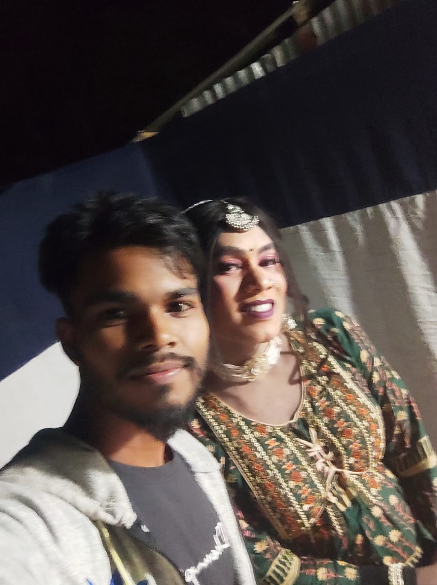
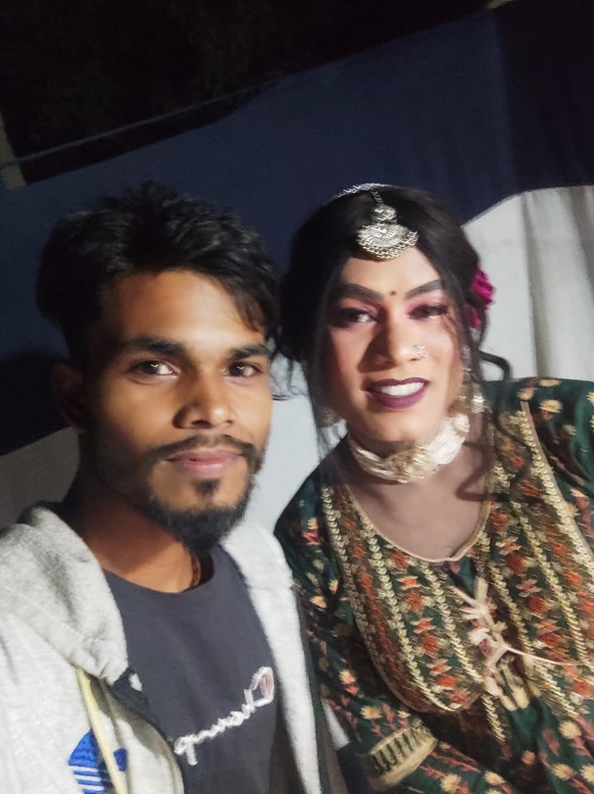

## Dondo Nach 2025

## Introduction

--- 

**This is Dondo Nach odia video , This dance has held in my village and I'd recorded some videos.**

---

## Images In Dondo

  

---

## Video Demonstration
You can download and view the video :

---

  
<video width="320" height="240" controls>
  <source src="./dondo-nach from online.mp4" type="video/mp4">
  Your browser does not support the video tag.
</video>

---

  
<video width="320" height="240" controls>
  <source src="./dondo-nach-madhabpur-8nog-1.mp4" type="video/mp4">
  Your browser does not support the video tag.
</video>

---

  
<video width="320" height="240" controls>
  <source src="./dondo-nach-madhabpur-8nog-2.mp4" type="video/mp4">
  Your browser does not support the video tag.
</video>

---

  
<video width="320" height="240" controls>
  <source src="./dondo-nach-madhabpur-8nog-3.mp4" type="video/mp4">
  Your browser does not support the video tag.
</video>

---

  
<video width="320" height="240" controls>
  <source src="./dondo-nach-madhabpur-8nog-5.mp4" type="video/mp4">
  Your browser does not support the video tag.
</video>

---

  
<video width="320" height="240" controls>
  <source src="./dondo-nach-madhabpur-8nog-6.mp4" type="video/mp4">
  Your browser does not support the video tag.
</video>

---

  
<video width="320" height="240" controls>
  <source src="./dondo-nach-madhabpur-8nog-7.mp4" type="video/mp4">
  Your browser does not support the video tag.
</video>

---

  
<video width="320" height="240" controls>
  <source src="./dondo-nach-madhabpur-8nog-8.mp4" type="video/mp4">
  Your browser does not support the video tag.
</video>

---

  
<video width="320" height="240" controls>
  <source src="./Mor Sajoni Amit Das Odia Song Sambalpuri DJ Dance.mp4" type="video/mp4">
  Your browser does not support the video tag.
</video>

---

